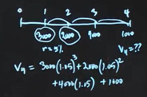
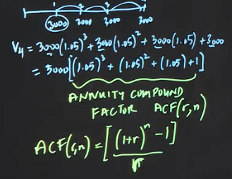
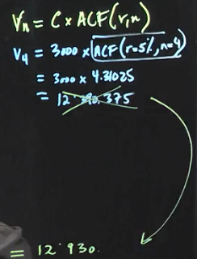
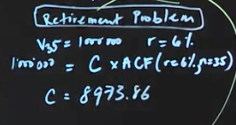
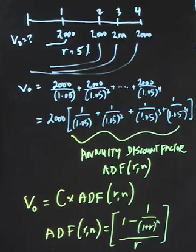
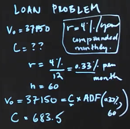
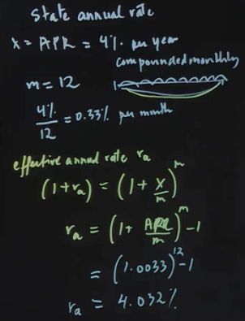
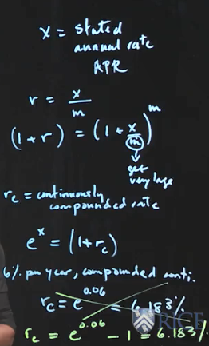

# Week 1
## What is the investment management process?
    1. Investment objects 
        1.1. Return
        1.1. Liability (cash flow)
        1.2. Expect of the risk

        What is benchment? 
    2. Investment policy
        Document describes all investment decisions
        Asset allocation decisions

    3. Measurement and evaluation of investment perfromance
        Monitoring portfolio, re-balancing

## Back to basics (Part 1.1): What is time value of money?

    How can compare Revenue in 1997 and 2009?
    I asked to lend me 100$ and I will pay 100$ in year

    Dollar today is worth more than a dollar tomorrow

    Why does money have time value?
        1. Postponed consumtion. You can use for your own consumtion. 
        2. Expected inflation
        3. Risk

    All above - opportunity cost - that's why it's positive rate (i.e. interest)

### How to find future value?
    Funds invested * opportunity cost
    After year = 100+100*0.05= 105;
    After 3 years = 100*(1.05)^3 - compounding

    Future value = interest rate;

### Finding the present value of a cash flow
    Presert value = 3 years value / (1.05)^3;

    Discount rate = Interest rate =  Opportunity cost of capital
    
## What are annuities?
    Fixed amount of cash flow within certain period of time

 Suppose you would like to have $50,000 in two years to start your new business idea.

### Stream of cash flow

### Annuity Compound Factor (Future value)
What if all cash flow is the same amount every year?

### Annuity Compound Factor (Present Value) - Retirement problem
What even annual savings or payments would you have to make to get to your goal if you can earn 6% per year? assuming that the interest rate is constant at 6%, expect to earn over the next 35 years

Future Value = 1 000 000 
Rate = 6%
Years = 35

### Finding the present value of annuities
Where we know the future value we know the constant interest rate and we know the number of payments and we try to find what the equal payments should be.

Knowns;
    1. Rate: 5%
    2. Years 2 years
    3. Expected annuity: 2000$

Question:
    1. What will be present value? 

### Annuities Example: Loan Problem
suppose the purchase price of the car that you would like to buy today is $37,150

Present value = 37150

you want to take out a loan, we're going to do a 100% financing with a maturity of 60 months, right, so there's going to be 60 payments.
first loan payment will come in one month's time

Interest Rate = 4%/y or 0.33%/mnth
Length = 5 years / 60 months

## Computing the effective annual interest rate

 credit card payments or car loan payments or mortgage payments are compounded not yearly, but typically monthly.

 what if the interest rate is being compounded every second instantaneously? Or continuously

 Interest rate = APR ( Annual Percentage Rate)

The problem: 
    APR is not what you really pay, Effective Rate is what you really pay

### What is Effective Rate?

## Computing an effective rate over any period
Say, APR 4%
Month rate = 4% / 12 = 0.0033%
Effective rate = (1.0033)^12 -1 = 4.032%

2month effective rate = (1.0033)^2 -1 = 0.6611%
...

## Computing continuously compounded rates

Question:
    What are your monthly payments?

