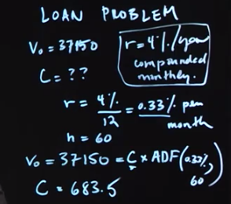

# Week 1
## What is the investment management process?
    1. Investment objects 
        1.1. Return
        1.1. Liability (cash flow)
        1.2. Expect of the risk

        What is benchment? 
    2. Investment policy
        Document describes all investment decisions
        Asset allocation decisions

    3. Measurement and evaluation of investment perfromance
        Monitoring portfolio, re-balancing

## Back to basics (Part 1.1): What is time value of money?

    How can compare Revenue in 1997 and 2009?
    I asked to lend me 100$ and I will pay 100$ in year

    Dollar today is worth more than a dollar tomorrow

    Why does money have time value?
        1. Postponed consumtion. You can use for your own consumtion. 
        2. Expected inflation
        3. Risk

    All above - opportunity cost - that's why it's positive rate (i.e. interest)

### How to find future value?
    Funds invested * opportunity cost
    After year = 100+100*0.05= 105;
    After 3 years = 100*(1.05)^3 - compounding

    Future value = interest rate;

### Finding the present value of a cash flow
    Presert value = 3 years value / (1.05)^3;

    Discount rate = Interest rate =  Opportunity cost of capital
    

## Back to basics (Part 2.1): What are annuities?

    Stream of cash flows, 
        how to find future value in 5 values having interest rate 5%? 

     FV = future cash value for every year and period and sum them up

     What if cash flow is equal every year than we can define ACF (r, n)

*Annuity Compound Factor (ACF)* 
 V(n) = C * ACF (R, n)

## Back to basics (Part 2.2): Annuities example: Retirement problem

   Target = 1 000 000$
   Years = 35
   Interest rate = 6%

*How much do we need to save every year?*

*Annuity Discount Factor (ADF)*  

What is Present value of cash flow?
 

## Back to basics (Part 2.4): Annuities Example: Loan Problem

Example:
    1. Car price today (present value): $37150
    2. Take loan (100%)
    3. Interest rate = 4% year or 4%/12 = 0.33% monthly
    4. Loan length = 60 monthers
    
    What car payments will be? 

    V(0) = 37150 = C X ADF(-.33%, 60) = 683.5

