# Week 1

  ### ML: 

  Arthur Samuel (1959) - chess playe - ability to learn how to play w/ o programming it explicitly.
  	

  Tom Michael (1998):
  	Problem defintion: A copoture program is said to leatn from experience E with respect to some task and some performance measuire P if its perofrmance on T as measured by P improves wwith 	experience E. i.e. performance imprvoes with more experience on T.

   		- E - expreience to play 
   		- T - play chess
   		- P - wins over chess player

  Spam:

   			- T-  classify email as spam or not spam
   			- E - label emails as spam or not spame 
   			- P - the number of emails correctly identified as spam

  			Supervise learning
  			Unsupervice learninig

  ### Supervised learning
    wE always tell what is currect answer during teaching.

    Regression - predict how much it will be in future

    	Problem: Large inventory. You want of identical items. You want to predict how many of there items will sell ove the next 3 month;

    Classiifcation  -defined number of results

    	Problem:
    		Softeware examine individual customer accounts and for each account decide if it has been hacked/compromised

       ### Example 1:
    		  	PLot : Y - Price / Size in feet - X

    		  	Instead straight line plot curve

    		  	Supervice learning - give  algorithm a right perices to calculte the right one

  

  ### Example 2:
        Is a tumor malignant(no cancer) or benign based on size?

        Breast cancer
        	X - size of tumore
        	Y - Malignant[0, 1]?

        	Yes/No plot

        Classification problem (Malignent / benign)

        1 feature is used - tumor size 

  

  ### Example 3:
  		    Is a tumor benign based on size & age?

  

  		    Many (finite) feature, how to do with it?

  ### Unsupervised learning

  Unsupervised learning has not lables on the data facts. The goal is to identify clusters (clustering algoritm). Example; google news, genese.

  Other examples:
  	-Social network analysis
  	-Market segement ()
  	-Astronomical analysis( how galazies are formed)
  	-Cocktail party problem (2 speakers, split speakers as result)

  ### Linear Regression
  	Context: houses perices

  	Notaion:
  		- m = number of training examnples
  		- x = inpit vraiable / feature
  		- y = out variable / target

   (x,y) - one trainig examples
   (x(i), y(i)) - i-th training examples

   

  Training set - > Learining argoritm -> h 

  

  Size of house (x) -> h -> Estimated price (y)

  

  #### How to choose Tetha0, Theta1?

  Idea: Choose Theta0, Theta1 so that h(x) is close to y for our training example (x,y)

  Cost function (squered error)  - The expression idea, find parameters Theta0, theta1 where h(x) -y is min

  

  #### Cost function

  

  Hyposis function h(x)
  Cost function J(Theta)

  Corelations
  
  
  
  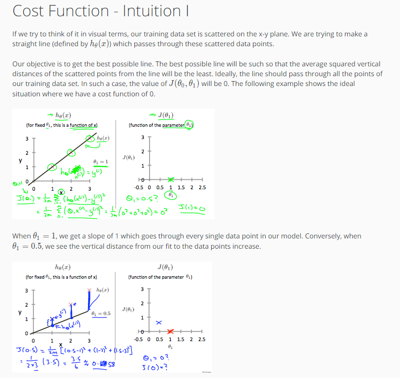
  

  #### Cost function intuition (Contour plots)

  More parametrs leads to more dimentions to cost function, 2 dim - can be shown as below:

  3d surface plot (Convex function - bowl shape)

  

  Contor plots  (instead 3d)

  
  

  
  

  ### Parameter Learning
  #### Gradient descent
   Problem setup:
      having some function J(Theta0, Theta1)
      want to min J(Theta0, Theta1)

   Outline:
   	Start with some Theta0, Theta1
   	Keep changing Theta0, Theta1 to reduce J(Theta0, Theta1) until end up at minimum

  

  Definition of algorithm:
  

  -Alpha - steps size in gradient (learning rate)
  -Partial derivative of J(Theta0, Theta1) - determins direction

  #### Gradient descent intuition

  

  Alpha too small:
  	- lots of steps in finding min

  Alpha too large:
  	- can overshoot the minimum (fail to converge, even diverge)

  If we are in local min - Thata1 ==Theta1	

  If Alpha is fixed, derivitive will have small and snaller steps when it's approaching minimum. No need to decrease Alpha.

  
  
  

  ### Gradient descent + linear regression
  sometimes call as "Batch" gradient descent - each step of gradient descvent uses all the training examples.

  
  
  
  
  

  ### Matrix and Vectors
  #### Matrix
  	rows x columns; 

  	R(4x2)
  	Matrix element - A(i,j); A(1,2) = 1 row and 2 column;
  	upper case - matrix ref.

  #### Vector
     1 column; R(4) - for dim vector;
     y(2); (lower case - vectors ref)

  #### Scalar
  	y = 2; not vector, not matrix;

  ### Matrix Addition
  #### Same dim
  	 3x2 + 3x2 = 3x2
  	 3x2 + 2x2 = error

  #### Scalar Multiplication
  	2 x [3x2] = [3x2]
  	4 / [3x2] = 1/4*[3x2] = [3x2]

  

  ### Multiplication
  ####Matrix - Vector
       3x2 * 2x1 = 3x1

  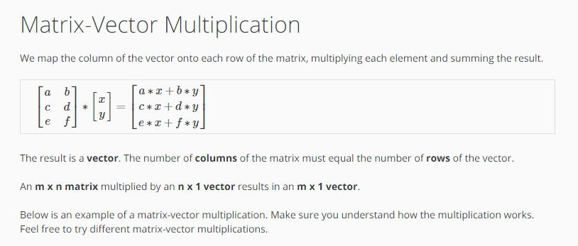

  How to calculate Hyposis function using trianing set:
  

  #### Matrix - Matrix
  	2x3 * 3x2 = 2x2

  

  

  #### Matrix Multiplication Properties
  	3*5 = 4*3 - commutative
  	
  	A*B != B*A - not commutative

  	3*5*2 = 5*2*3 - associative

  A*B*C = A*(B*C) = (A*B)*C  - associative

  ##### Identity Matrix
     A*I = I*A = A

     mXn * nXn = mXm * m*n  = mXn - commutative

  

  #### Matrix inverse and transpose

  ##### Inverse
   1 = identity
   3*(3^-1) = 1
  0*(0^-1) = undefined

   Matrix inverse
   AA(A^-1) = A^-1*A = I

  A = [3,4;2,6]
  p[inv](A) = [0.4 , -0.1; -0.05, 0,075] - inversed A

  A = [0,0; 0,0] - non-inversable
  ##### TRanspose

  A = [1,2,0; 3,5,9]
  A' = [1,3; 2,5;0,9] - transposed

  

# Week 2

  ## Multivariate Linear Regression

  ### Mutiple features
    Context: Predict house price with more features (size, number of beds, no floors, age, price)

    x1 - size
    x2 - bedrooms
    x3 - floors
    x4 - age
    y = price

  
  
  
  
  

  ### Gradient Descent in Practice I - Feature Scaling

  Contour is skinny if the scale of feature is very different, but scaling it down it allows contour plots to be more effective for gradient descent to work out the minimum (w/ less steps)

  Idea: get every feature into approx. a -1 <= x(i) <= +1 range;

  

  #### Mean normalization
  	x(i) = (size(i) - mean(i)) / range(i) - ( max - min)

  

  ### Gradient Descent in Practice II - Learning Rate

  
  

  ### Features and Polynomial Regression

  Context: House price prediction with frontage and depth as features
  Idea: 
  	you can create 1 feature instead using 2 features
  	area = frontage * depth;
  ####  Polynomial Regression

  Options:
  h(x) = Theta0+Thata1*x+Theta2*x^2 (dependes on training set)
  h(x) = Theta0+Thata1*x+Theta2*x^2+Theta3*x^3
  h(x) = Theta0+Thata1*x+Theta2*sqrt(x)

  

  ## Computing Parameters Analytically
  ### Normal Equation
  	alternative to Gradient Descent to get 0

  	Intuition:
  		Assume: Thatea is a raw number

  		J(Thata) = a*Thata^2 + b*Theta + c

  		Solution: Get J derivative and assign it to 0

  
  

  Feature scaling is NOT required for Normal Equation!

  

  Pros & Cons:

  

  ### Normal Equation Noninvertibility
  Sometimes X'*X non-invertable.

  

  ## Octave
  ### Operations
     - not equal - ~=
     - PS('>> ');  - change command line string
     - ; in the end supresses the output
     - b = 'hi'
     - disp(sprintf('2 deciamls: %0.2f', a))
     - format long / format short]

  ### Matrixes

    - v = 1:0.1:2 
    - 2*ones(2,3)  - 2x3
    - zeros(1,3) - 1x3
    - rand(3,3) 3x3
    - randn(1,3) - gausian dist
    - hist(w,50) - print histogram w/ 50 bars
    - help eye
    - size(A)
    - length(A) - longer dimention
    - A(2, :) - show everything second row
    - A(:, 2) - show everything in second column
    - A([1 3], :) - get from 1 and 3 row 
    - A(:, 2) = [ 10; 11; 12] - replace second column with new values
    - A(A, [100; 101; 202]) - add new column to right
    - A(:) - put all elements into vector
    - C = [A B] or [A, B] - conctatination 2 matrcies
    - C = [A; B] - put B matrix on bottom of A
    - 

  ### Data operations

  - pwd - path
  - ls - files list
  - cd - go to dir
  - load('file.dat') - load file into Octave
  - who - what variables in mem
  - clear A - remove variable from mem
  - v = priceY(1:10) - First 10 elements 
  - save hello.dat v; - save data into file
  - save hello.dat v - ascii; - text file save

  ### Computation
   - A*C - matrix multiplaication
   - A .* B - element-wise multiplication 
   - A .^ B 
   - 1 ./A
   - log(v)
   - exp(v)
   - abs(v)
   - -v
   - v+ones(length(v), 1) - increase everything by 1
   - v + 1
   - A' - transpose
   - [val, ind] = max(A) - return max and location
   - a < 3 - return matrix 0,1
   - find(a < 3) - return idx of element meets the criteria
   - A = magic(3) - generates 3x3
   - [r,c] = find(A>=7) - return row and col numbers
   - sum()
   - floor()
   - ceil()
   - rand(3) - 3x3
   - max(A, [], 1) - max colum wise
   - max(A, [], 1) - max row wise
   - sum(A, 1) - sum colum wise
   - sum(A, 2) - sum row wise
   - flipup(A)
   - pinv(A) - inverse
   
  ### Plotting

    - plot(t, y1); t=[0, 0.1, 2]; y1=sin(2*pi*4*t);
    - hold on; - plots on top of existing
    - plot(t, y1, 'r') - plots red
    - xlable('time');
    - title('miplot')
    - print -dpng 'myplot.png'
    - help plot
    - close - close plot
    - figure(1); plot(t,y1)'
    - figure(2); plot(t, y2);
    - subplot(1,2,1);
    -     plot(t, y2);
    -     subplot(1,2,2);
    -     plot(t, y1);
    - axis([0.5 1 -1 1]);
    - clf; - clear figure
    - imagesc(A); - grid of color
    - imagesc(A), colorbar, colormap gray; - 3 commands runs each after another

  ### Control Statements: for, while, if statement
   
  #### FOR
   - for i=1:10, v(i) = 2^i; end;
   - indices=1:10;
      -for i=indices, disp(i); end;

  #### WHILE

  - i =1;
  - while i <= 5,
      + v(i) = 100;
      + i = i+ 1;
      + end;
  - i=1;

  - while true,
      + v(i) = 999;
      + i = i+1;
      + if i == 6,
          * break;
      + end;
     end;

  #### IF

  - if (v1) == 1,
  -   disp(' one');
  - elseif v(1) == 2,
  -   disp('two')
  - else
  -   disp('other');
  - end;   

  #### Functions
    1. create file myFunction.m

    2. add body:
    
      function y = myFunction(x)
      y= x^2;
   
   3. cd to location
   4.myFunction(5); 

  addpath('path to functions files');

  ##### Functions (many return values)
  function [y1,y2] = myFunction(x)  -- multi values returned
      y1= x^2;
      y2= x^3;

  ##### Vectorization 

  
  

# Week 3
  ## Classification (binary classification problem)
  	called Logistic Regression 

  ####  Problem:
  		Email: Spam/Not Spam
  		Online Transactions: Fraudulent (Yes, No)
  		Tumor: Mlignant/Benign

  		y e {0,1} - binary classification problem

  		0 - Negative class
  		1 - Positive class

  		h = O^T*x

  		Threshold: 
  			if h >= 0.5 - predict y = 1;
  			if h < 0.5 - predict y = 0;

  ####  Why linear regression does not fit to classification problem?
  		1. If there is a fact far behind most of the training set facts, it affects the performance badly		
  		2. h can be > 1 or < 0

  

  #### What is solution?
  		Logistic Regression (classification algoritm, not regression): 0 <= h <= 1

  ## Hypothesis Representation
  	Goal:  0 <= h <= 1

  	h = g(Theta^T*x)
  	g - sigmoid, or logisitc function 

  

  ##### Interpretation
  	h  becomes probabilty P - 1 - 100% probable
  

  ## Decision boundary
  	y = 1 if h >= 0.5 or  Theta^T*x >= 0 
  	y = 0 if h < 0.5 or  Theta^T*x < 0 

  
  
  NOTE: decision boundary is a property of the hyposis, not the data set.

  ### Non-liner decision boundaries
  	h = g(Theta0 + Theta1*x1 + Theta2*x2 + Theta3*x1^2 + Theta4*x2^2);

  

  ## Logistic regresion. Cost Function
  	Hot to choose paramter Theta?

   

   the problem:
   	the sigmoid / logistic functio leads is non-convex Cost function (J)(having many minimums) so it's hard to find global minimum	

   

  solution:
  	Different cost function:
  		J(h(x), y) = { -log(h(x))} if y = 1; 
  		               -log(1-h(x))} if y = 0; }

   		               
     Intuition:
         if h(x) = 0 (predict P(y=1) = 0), but y = 1 we penalize learning argorthm by very large cost;

           
  Intuition:
         if h(x) = 1 (predict P(y=0) = 0), but y = 0 we penalize learning argorthm by very large cost;

     

  ## Simplified Cost Function and Gradient Descent

    
    
    
    

  ## Advanced Optimization
      Optimized algorithms:
          - Conjugate gradient
          - BFGS
          - L-BFGS

      Advantages:
          - No need to manually poick Alpha
          - Often faster than gradient descent
      Disadvanteges:
          - More complex

    
  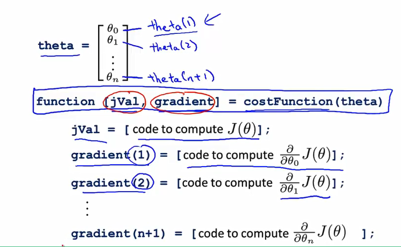  

  ## Multiclass Classification: One-vs-all
      Examples: 
    
   
   

  ## Overfitting

  Linear regression:

   

  Logistic regression:

   

  ### How to address?
    
      1. We can plot and see (does not work for many feature as hard to plot)
      2. Reduce number of features
      3. Model select algorithm (reducing features by algorithm)
      4. Regularization (Keep all features but reduce magnitude/values of Theta)

  ## Regularization

    Intuition:

   

    Small values of parameters Thata:
      - Simpler hyposiss (That3,4 ~ 0)
      - Less prone to overfitting

    Housing:
      -Features: x1,...,X100
      -Parameter: Theta0,...,Theta100  

   

  Lambda - reg. parameter.

  Goal:
    Find tradeoff between: 
    - we would like to fit to traing set well
    - keeping hyposis relatively simple

    Usually Theta0 is NOT regularized.

   
   

  ## Regularized Linear Regression

  ### Reg. for Gradient Descent

   
   

  ### Reg. for Normal Equasion

   

  L is a matrix with 0 at the top left and 1's down the diagonal, with 0's everywhere else. It should have dimension (n+1)×(n+1). Intuitively, this is the identity matrix (though we are not including x_0x 
  0
  ​  ), multiplied with a single real number λ.

  Recall that if m < n, then X^TXX 
  T
   X is non-invertible. However, when we add the term λ⋅L, then X^TXX 
  T
   X + λ⋅L becomes invertible.

  X is non-invertible. However, when we add the term λ⋅L, then 

  ## Regularized Logistic Regression

   
   

# Week 4 (Neural networks)

##Non-linear Hypotheses

Why do we need it NN?
 1. It might be hard to find non-linear function due to 
 - many features 
 - hard to calculate
 - Theta(n^3)
 2. Recognize if the image is car or not?
 - 50x50 pixel -> 2500 pixel; n = 2500 (7500 if RGB)
 - Quadratic features = 3 mil
 
## Neurons and the Brain

 
 

## Model Representation 1

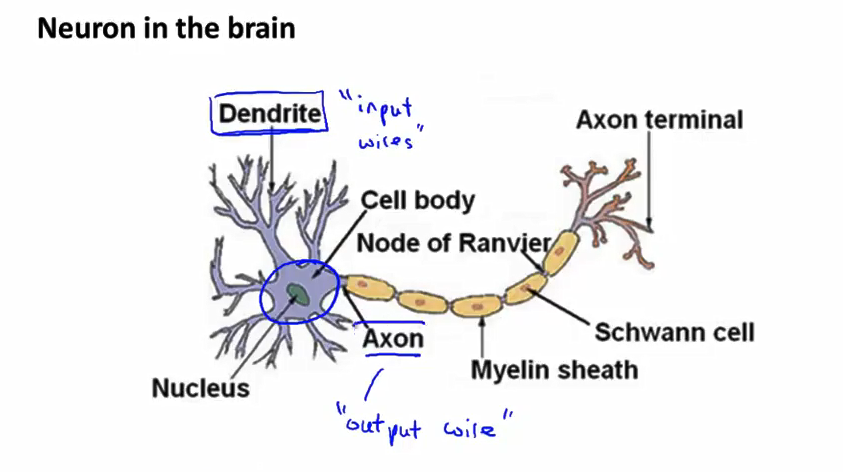 
 

### Neuron 
  Key terms:
    1. Neuron input wises
    2. Neuron output
    3. Bias unit
    4. Weights = parameters *theta*

 

### Neuron Network
  Key terms:
  - 1 Layer - Input layer
  - Last Layer - Output Layer 
  - Layers in middle = hidden layers
  - Units - elements of layer

 

 

## Model Representation 2
Forward propogatio method;

1. Definig z vector;
2. x = a(1) vecotr -> z(2) = Thata(1)*a(1)
3. a0(2) = 1

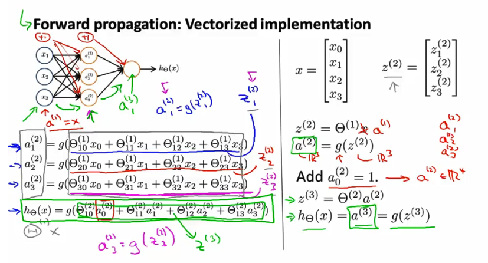 

Simplified version of the NN is Logistic Regression with one different it uses a vector instead of x, so it a "learns" from x vector

 

other NN architectectures:

 

## Examples and Intuitions I

### non-linear classification example: XOR/XNOR

i.e. both x1, x2 is true or both are false i.e. y = x1 AND x2
 

#### Logical AND NN:

 

#### Logical OR NN:
 

## Examples and Intuitions II

### complex non-linear 
  
#### NOT x1 and Not X2

 

#### x1 XNOR x2

combining:
   1. x1 AND x2; 
   2. (NOT x1) AND (NOT x2);
   3. x1 OR x2

1, 2 - layer 2
3 - layer 3

 

## Multiclass Classification

Example: recognize 1-9 number from picture.

Problem (one vs all):
 Rcognize Pedestrial, Car, Motorcycle, Truck on the picture

Design solution:
    1. 4 output layer units (each for each case);
        1.1 when pedestrial: h = [1; 0; 0; 0]
        1.2 when car: h = [0; 1; 0; 0]
        ...

 

y  represts vector rather than list of number 1,2,3,4

the goal is to find Thatas so h ~ y

 

# Week 5

## Cost Function

   L - total number of layers
   s(l) = no of units (not counting bias unit) in layer l
   K - no of class
   S(L) = no of output units

Two type of classificaiton problem:
  1. Binary 
      y e {1,0}

      h = 1 unit
      S(L) = 1
      K = 1 (output units)

      2. Multi-class classification, say, 4 classes
        y e R^K e.g y = [1; 0; 0; 0]; [0; 1; 0; 0] ..
        h = R^K
        S(L) = K (K >= 3)

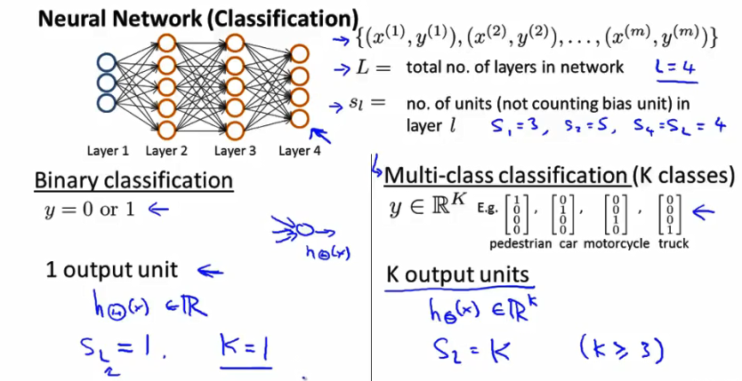 

### Cost function definition
  NOTE: regularization does NOT applied for bias units.

  SL - output unit number
  K - output unit in output layer = output classes
  K = No of classes - 1

   
   

NOTE: Regularization terms does not count bias unit

### Backpropogation
  i.e. how to minimize Cost gunction

 

 Case 1: just x,y

 

#### Backpropogation algorithm
How to minimize J(0)? i.e. calculation of derivative for NN

Steps:
  1. Forward propogation - allow to compute activation numbers for all neurons (a)
  2. In order to calculate derivatives , we use backward calculation algorithm:
   for each node we calculate error for every node delta.j(l)

error in output layer is a __delta__ between the value in learning set and calculated by activation unit

g'(z(3))  = a(3).*(1-a(3)) - g' is derivateive

Notes:
1. No __delta__ for input layer.
2. Ignoring Lambda for now
  
  
 

DELTA - accumulate lower case delta 

 

D.ij(l) is a partial derivative for J(0)

## Backpropogation intuition 
 
 

## Implementation Note: Unrolling Parameters

The problem:
  if fminunc function is used to find optTheta, it accepts vectors rather than matrices. How to deal with it? - unroll matrix to vector

 
 

Steps:
1. Having init parameters Thata1, Theta 2, Theta 3
2. Unroll to get initialTheta to pass too
3. fminunc(@costFunction, initialTheta, options)
4. Define costFunction
4.1. in costFunction, from thetaVec, get Theta1, Theta2, Theta3
4.2. in costFunction, use forward prop/back to compute D(1), D(2), D(3) and J(Theta)
4.3. unroll D(1), D(2), D(3) to get gradientVec

## Gradient Checking

Idea: test the implementaiton of prop & back prop is correct

Impl: to calculated derivative approx w/o actual derivative execution

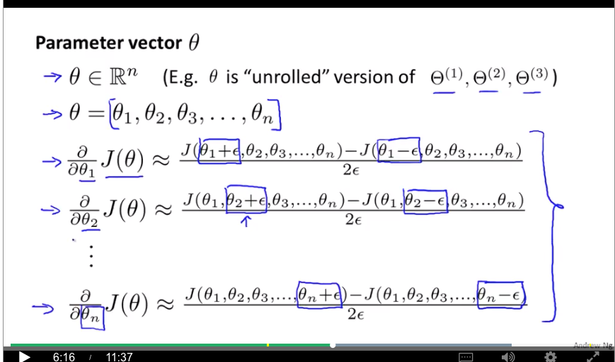
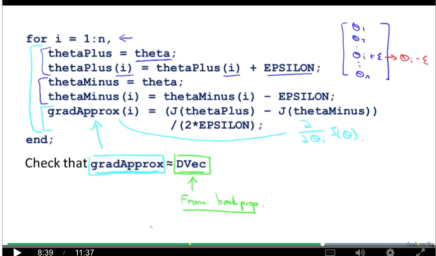

__Implementation notes:__
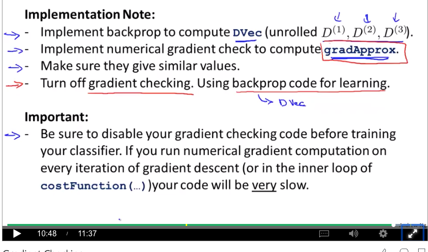

## Random Initialization

last thing needed for NN training - initialTheta

What does it set to?

Say, initalTheta = 0 than:
a1(2) = a2(2); 
delta1(2) = delta2(2);
Theta01(1) = Theta02(1)
derv01(1) = deriv02(1)

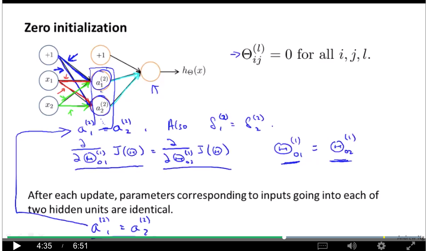
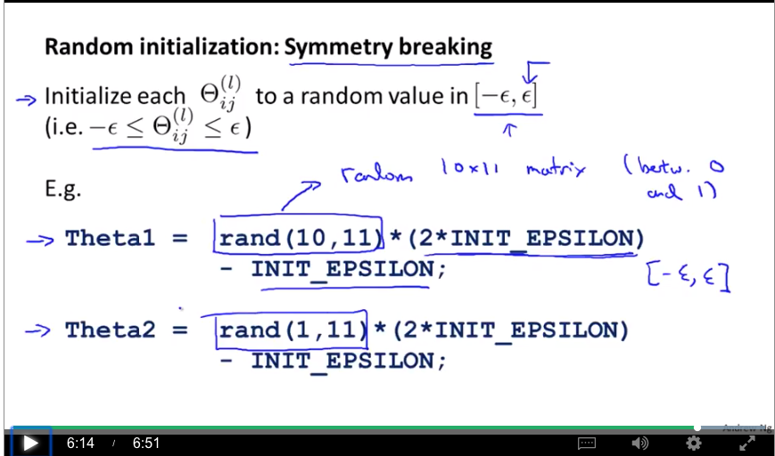

## Putting It Together

Steps:
1. Choose the NN architecture, how
  1.1 No of input = dimentions of features
  1.2 No. output units = number of classes
  1.3. No of hidden = default is 1 hidden layer
  1.4 No of hidden units = the more the better
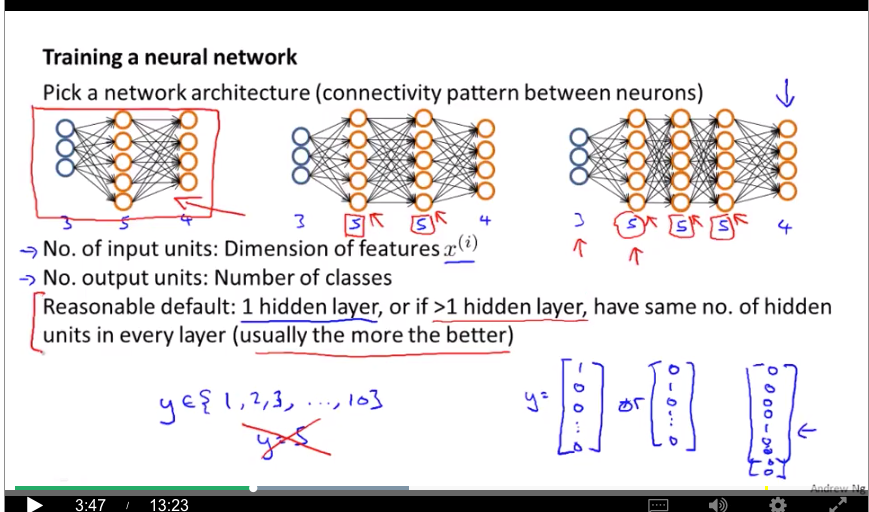
2. Training a neural network

3. Training a neural network
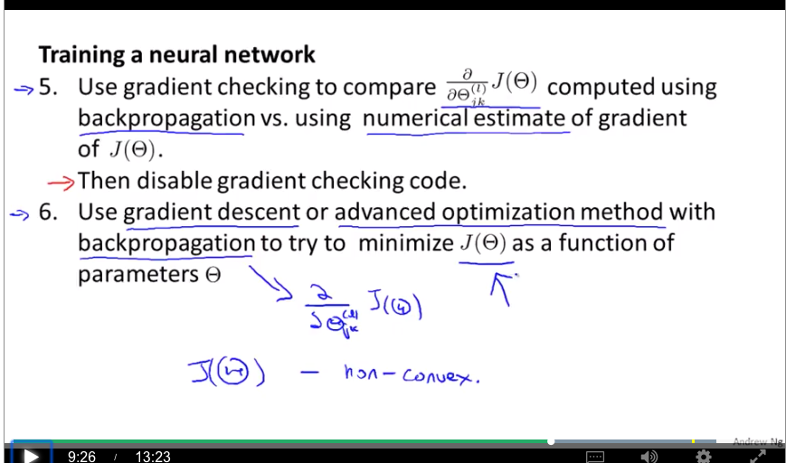
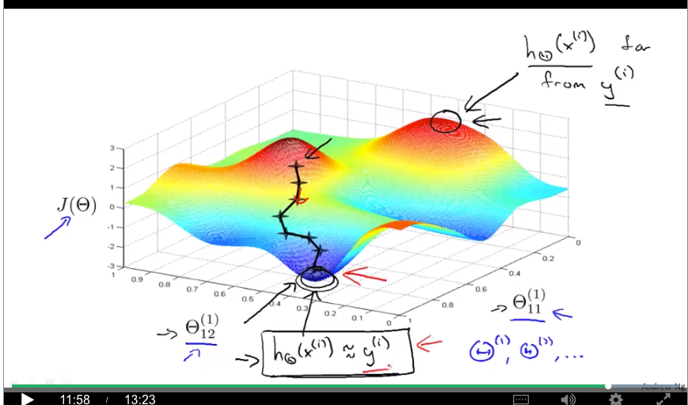

# Week 6

## Deciding What to Try Next

Suppose we have housing prices regularized linear regression but it gives unacceptable error when hypothesis applied for new data, what to do?

Options:
 1. More training examples
 2. Try smaller sets of features
 3. Try to get additional features
 4. Try to add plynomian features
 5. Try to descrease Lambda
 6. Try ito ncreate Lambda

There is technic gives a hint what will work - Machine learining diagnositc.

Diagnostic - a test you can run, to get insight into what is or isn't working with an algorithm, and which will often give you insight as to what are promising things to try to improve a learning algorithm's

Diagnostic may be time consuming but it safes time later;

## Evaluating a Hypothesis

Low training error does not mean it will be performant for new data.
It's hard to plot hypothsis due to number of features. 

What to do?
  1. Split data into 2 portion
  2. 70% -training set (randomly)
  3. 30% - testing set (m.test - no of test examples) (randomly)

### Learning procedure for linear regression
  1. Learn parameter Theta from training data (70%) (min training error J(Theta))
  2. Compute test set error (J(Theta)) (taking Theta from step 1) using test set.

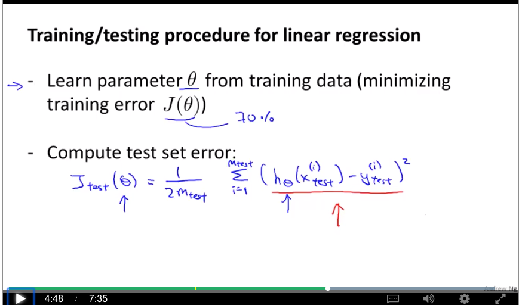

### Learning procedure for logistic regresion
Misclassification error - another technic

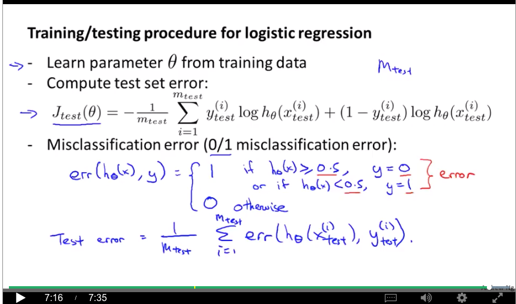

## Model Selection and Train/Validation/Test Sets
Model selection 

  1. you're left to decide what degree of polynomial to fit to a data set.
  2.  suppose you'd like to choose the regularization parameter longer for learning algorithm

Trainig set Cost may NOT be reliable

switch data into what we discover is called the train, validation, and test sets and see the results for different models

Model selection is degree of polynomial.

Say, we choose 5th polinom as it gives best performance J.test(Theta(5)). 
However, there is problem: J.test(Theta(5)) is likely to be optiomistic estimates of generalization error i.e. (d = degree of polynomial) is fit to test set. 

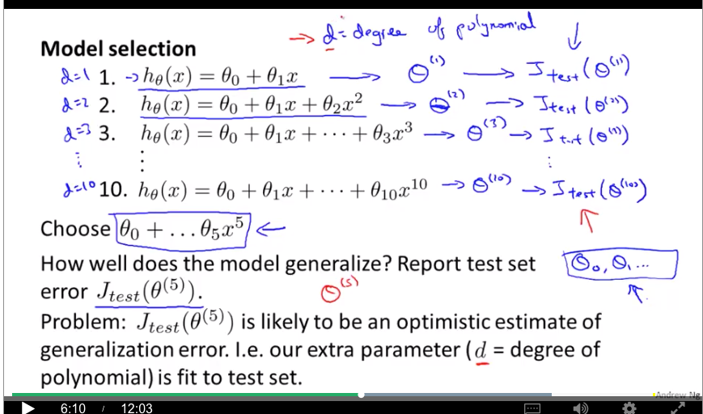
Conclusion: The performance of particular degree of polinom is not always reliable as it overfitting the testing set.

How to select the right model?

 

