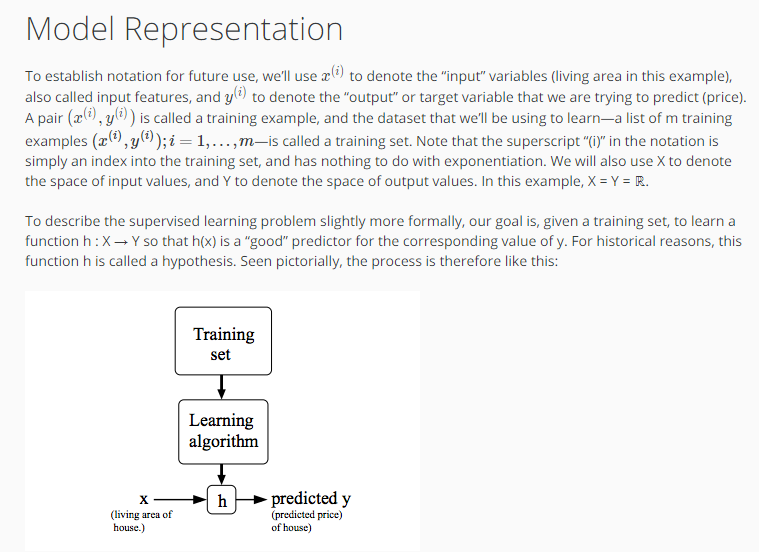
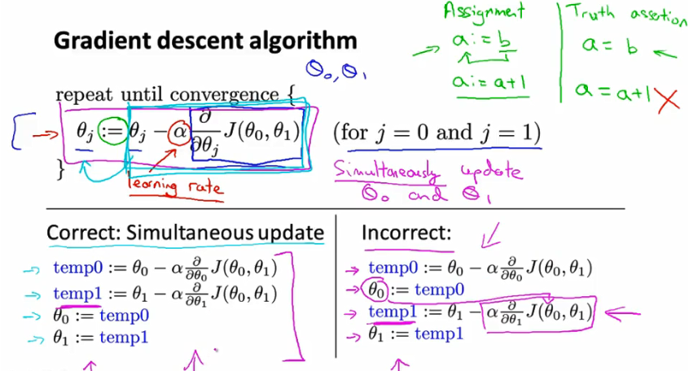
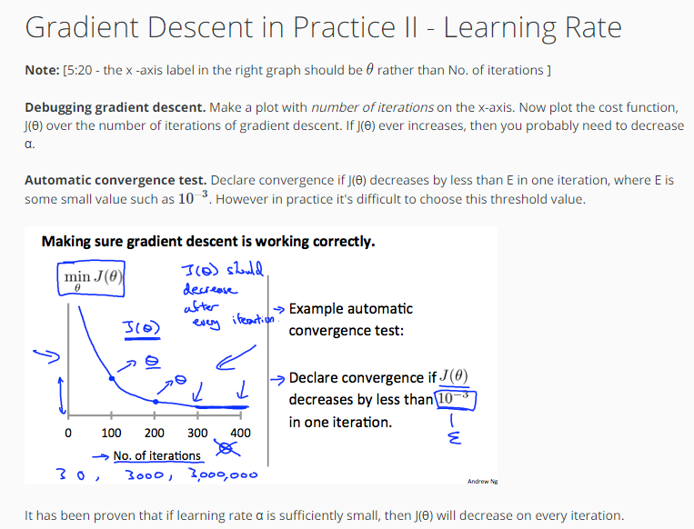

# Week 1
### ML: 

Arthur Samuel (1959) - chess playe - ability to learn how to play w/ o programming it explicitly.
	

Tom Michael (1998):
	Problem defintion: A copoture program is said to leatn from experience E with respect to some task and some performance measuire P if its perofrmance on T as measured by P improves wwith 	experience E. i.e. performance imprvoes with more experience on T.

 		- E - expreience to play 
 		- T - play chess
 		- P - wins over chess player

Spam:

 			- T-  classify email as spam or not spam
 			- E - label emails as spam or not spame 
 			- P - the number of emails correctly identified as spam

			Supervise learning
			Unsupervice learninig

### Supervised learning
wE always tell what is currect answer during teaching.

Regression - predict how much it will be in future

	Problem: Large inventory. You want of identical items. You want to predict how many of there items will sell ove the next 3 month;

Classiifcation  -defined number of results

	Problem:
		Softeware examine individual customer accounts and for each account decide if it has been hacked/compromised

   ### Example 1:
		  	PLot : Y - Price / Size in feet - X

		  	Instead straight line plot curve

		  	Supervice learning - give  algorithm a right perices to calculte the right one

### Example 2:
		    Is a tumor malignant(no cancer) or benign based on size?

		    Breast cancer
			  	X - size of tumore
			  	Y - Malignant[0, 1]?

			  	Yes/No plot

			Classification problem (Malignent / benign)

			1 feature is used - tumor size 

### Example 3:
		    Is a tumor benign based on size & age?

		    Many (finite) feature, how to do with it?

### Unsupervised learning

Unsupervised learning has not lables on the data facts. The goal is to identify clusters (clustering algoritm). Example; google news, genese.

Other examples:
	-Social network analysis
	-Market segement ()
	-Astronomical analysis( how galazies are formed)
	-Cocktail party problem (2 speakers, split speakers as result)

### Linear Regression
	Context: houses perices

	Notaion:
		- m = number of training examnples
		- x = inpit vraiable / feature
		- y = out variable / target

 (x,y) - one trainig examples
 (x(i), y(i)) - i-th training examples

 

Training set - > Learining argoritm -> h 

Size of house (x) -> h -> Estimated price (y)

#### How to choose Tetha0, Theta1?

Idea: Choose Theta0, Theta1 so that h(x) is close to y for our training example (x,y)

Cost function (squered error)  - The expression idea, find parameters Theta0, theta1 where h(x) -y is min

#### Cost function

Hyposis function h(x)
Cost function J(Theta)

Corelations

#### Cost function intuition (Contour plots)

More parametrs leads to more dimentions to cost function, 2 dim - can be shown as below:

3d surface plot (Convex function - bowl shape)

Contor plots  (instead 3d)

### Parameter Learning
#### Gradient descent
 Problem setup:
    having some function J(Theta0, Theta1)
    want to min J(Theta0, Theta1)

 Outline:
 	Start with some Theta0, Theta1
 	Keep changing Theta0, Theta1 to reduce J(Theta0, Theta1) until end up at minimum

Definition of algorithm:

-Alpha - steps size in gradient (learning rate)
-Partial derivative of J(Theta0, Theta1) - determins direction

#### Gradient descent intuition

Alpha too small:
	- lots of steps in finding min

Alpha too large:
	- can overshoot the minimum (fail to converge, even diverge)

If we are in local min - Thata1 ==Theta1	

If Alpha is fixed, derivitive will have small and snaller steps when it's approaching minimum. No need to decrease Alpha.

### Gradient descent + linear regression
sometimes call as "Batch" gradient descent - each step of gradient descvent uses all the training examples.

### Matrix and Vectors
#### Matrix
	rows x columns; 

	R(4x2)
	Matrix element - A(i,j); A(1,2) = 1 row and 2 column;
	upper case - matrix ref.

#### Vector
   1 column; R(4) - for dim vector;
   y(2); (lower case - vectors ref)

#### Scalar
	y = 2; not vector, not matrix;

### Matrix Addition
#### Same dim
	 3x2 + 3x2 = 3x2
	 3x2 + 2x2 = error

#### Scalar Multiplication
	2 x [3x2] = [3x2]
	4 / [3x2] = 1/4*[3x2] = [3x2]

### Multiplication
####Matrix - Vector
     3x2 * 2x1 = 3x1

How to calculate Hyposis function using trianing set:

#### Matrix - Matrix
	2x3 * 3x2 = 2x2

#### Matrix Multiplication Properties
	3*5 = 4*3 - commutative
	
	A*B != B*A - not commutative

	3*5*2 = 5*2*3 - associative

A*B*C = A*(B*C) = (A*B)*C  - associative

##### Identity Matrix
   A*I = I*A = A

   mXn * nXn = mXm * m*n  = mXn - commutative

#### Matrix inverse and transpose

##### Inverse
 1 = identity
 3*(3^-1) = 1
0*(0^-1) = undefined

 Matrix inverse
 AA(A^-1) = A^-1*A = I

A = [3,4;2,6]
p[inv](A) = [0.4 , -0.1; -0.05, 0,075] - inversed A

A = [0,0; 0,0] - non-inversable

##### TRanspose

A = [1,2,0; 3,5,9]
A' = [1,3; 2,5;0,9] - transposed

# Week 2

## Multivariate Linear Regression

### Mutiple features
  Context: Predict house price with more features (size, number of beds, no floors, age, price)

  x1 - size
  x2 - bedrooms
  x3 - floors
  x4 - age
  y = price

### Gradient Descent in Practice I - Feature Scaling

Contour is skinny if the scale of feature is very different, but scaling it down it allows contour plots to be more effective for gradient descent to work out the minimum (w/ less steps)

Idea: get every feature into approx. a -1 <= x(i) <= +1 range;

#### Mean normalization
	x(i) = (size(i) - mean(i)) / range(i) - ( max - min)

### Gradient Descent in Practice II - Learning Rate

### Features and Polynomial Regression

Context: House price prediction with frontage and depth as features
Idea: 
	you can create 1 feature instead using 2 features
	area = frontage * depth;
####  Polynomial Regression

Options:
h(x) = Theta0+Thata1*x+Theta2*x^2 (dependes on training set)
h(x) = Theta0+Thata1*x+Theta2*x^2+Theta3*x^3
h(x) = Theta0+Thata1*x+Theta2*sqrt(x)

## Computing Parameters Analytically
### Normal Equation
	alternative to Gradient Descent to get 0

	Intuition:
		Assume: Thatea is a raw number

		J(Thata) = a*Thata^2 + b*Theta + c

		Solution: Get J derivative and assign it to 0

Feature scaling is NOT required for Normal Equation!

Pros & Cons:

### Normal Equation Noninvertibility
Sometimes X'*X non-invertable.

