## Week 1
### ML: 

Arthur Samuel (1959) - chess playe - ability to learn how to play w/ o programming it explicitly.
	

Tom Michael (1998):
	Problem defintion: A copoture program is said to leatn from experience E with respect to some task and some performance measuire P if its perofrmance on T as measured by P improves wwith 	experience E. i.e. performance imprvoes with more experience on T.

 		- E - expreience to play 
 		- T - play chess
 		- P - wins over chess player

Spam:

 			- T-  classify email as spam or not spam
 			- E - label emails as spam or not spame 
 			- P - the number of emails correctly identified as spam

			Supervise learning
			Unsupervice learninig

### Supervised learning
wE always tell what is currect answer during teaching.

Regression - predict how much it will be in future

	Problem: Large inventory. You want of identical items. You want to predict how many of there items will sell ove the next 3 month;

Classiifcation  -defined number of results

	Problem:
		Softeware examine individual customer accounts and for each account decide if it has been hacked/compromised

   ### Example 1:
		  	PLot : Y - Price / Size in feet - X

		  	Instead straight line plot curve

		  	Supervice learning - give  algorithm a right perices to calculte the right one

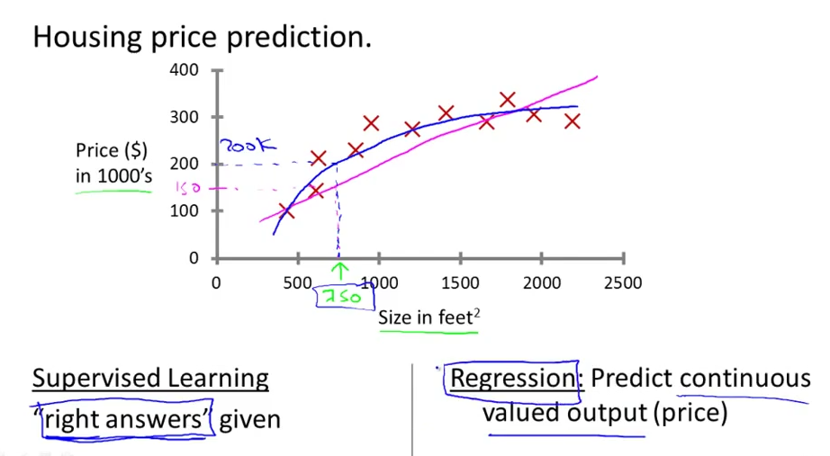

### Example 2:
		    Is a tumor malignant(no cancer) or benign based on size?

		    Breast cancer
			  	X - size of tumore
			  	Y - Malignant[0, 1]?

			  	Yes/No plot

			Classification problem (Malignent / benign)

			1 feature is used - tumor size 

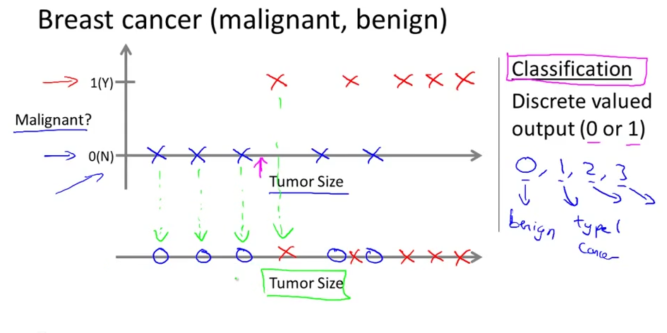

### Example 3:
		    Is a tumor benign based on size & age?

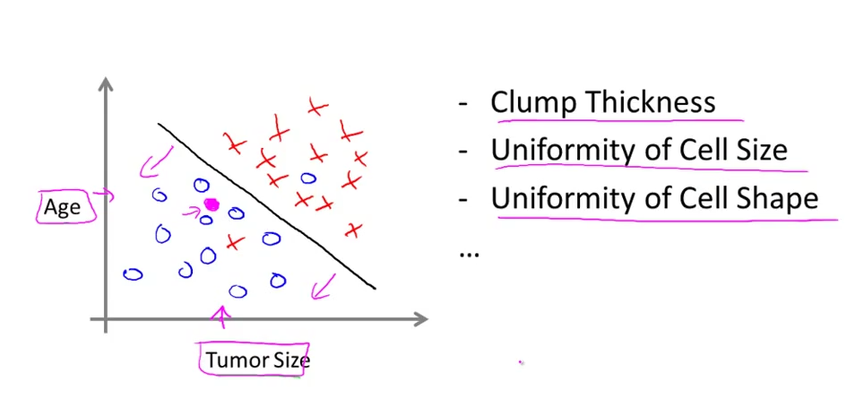

		    Many (finite) feature, how to do with it?

### Unsupervised learning

Unsupervised learning has not lables on the data facts. The goal is to identify clusters (clustering algoritm). Example; google news, genese.

Other examples:
	-Social network analysis
	-Market segement ()
	-Astronomical analysis( how galazies are formed)
	-Cocktail party problem (2 speakers, split speakers as result)

### Linear Regression
	Context: houses perices

	Notaion:
		- m = number of training examnples
		- x = inpit vraiable / feature
		- y = out variable / target

 (x,y) - one trainig examples
 (x(i), y(i)) - i-th training examples

 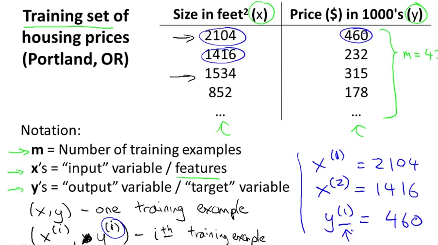

Training set - > Learining argoritm -> h 

Size of house (x) -> h -> Estimated price (y)

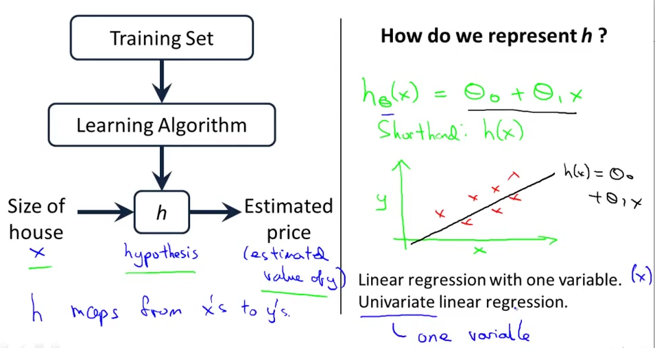

#### How to choose Tetha0, Theta1?

Idea: Choose Theta0, Theta1 so that h(x) is close to y for our training example (x,y)

Cost function (squered error)  - The expression idea, find parameters Theta0, theta1 where h(x) -y is min

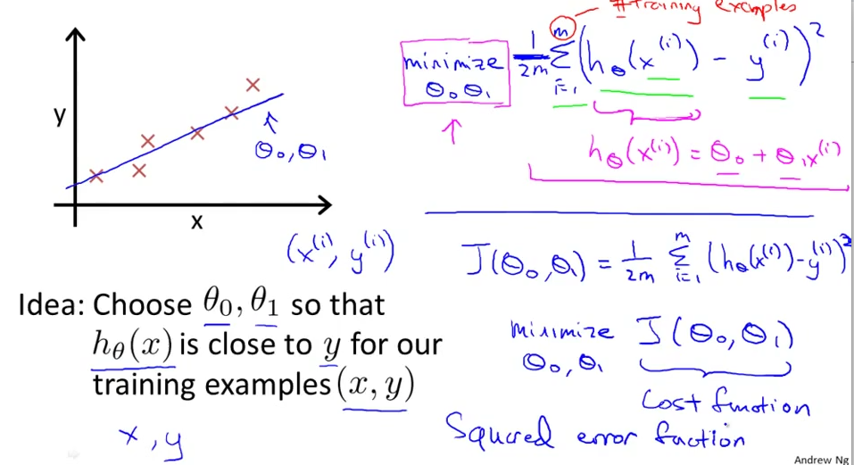

#### Cost function

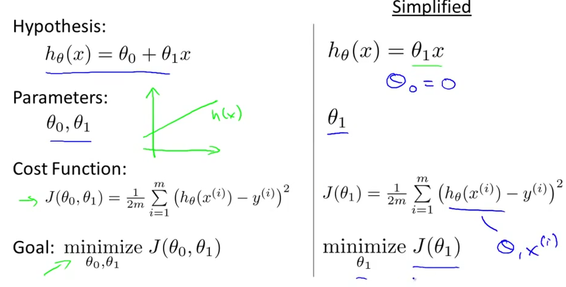

Hyposis function h(x)
Cost function J(Theta)

Corelations
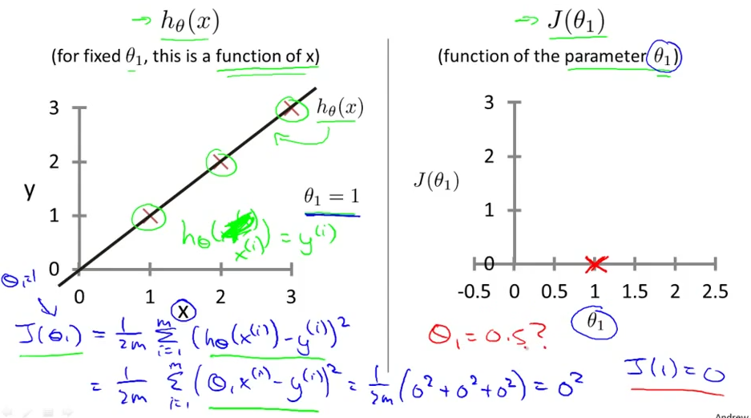

#### Cost function (Contour plots)

More parametrs leads to more dimentions to cost function, 2 dim - can be shown as below:

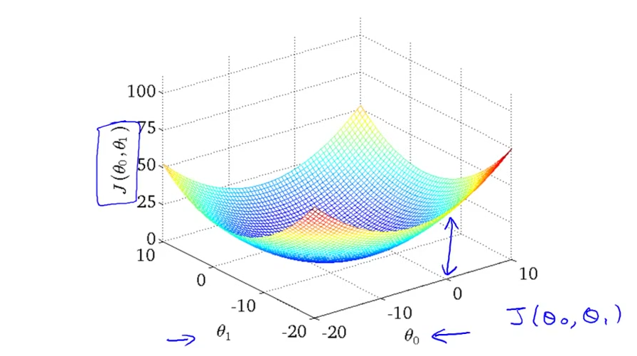

Contor pltos 

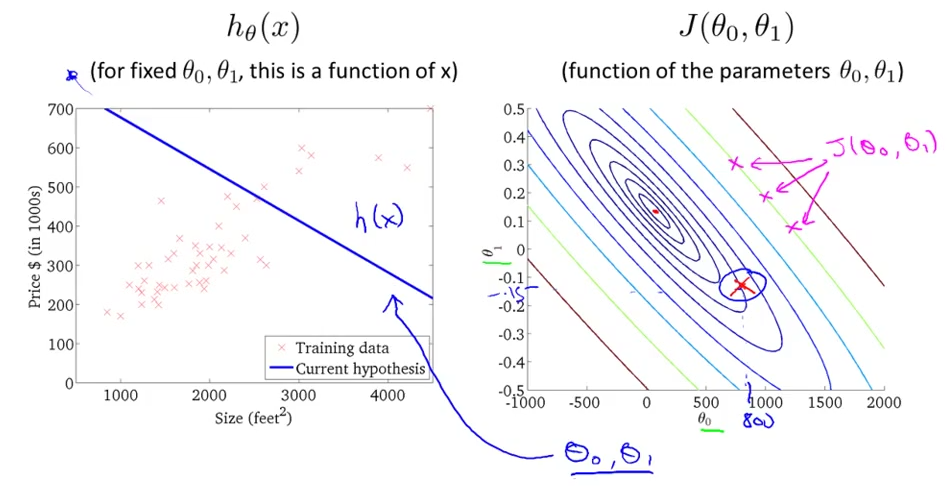
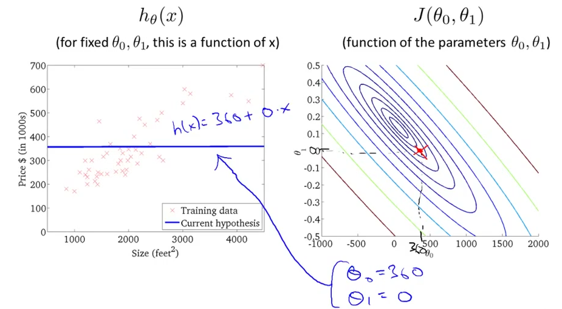

 

