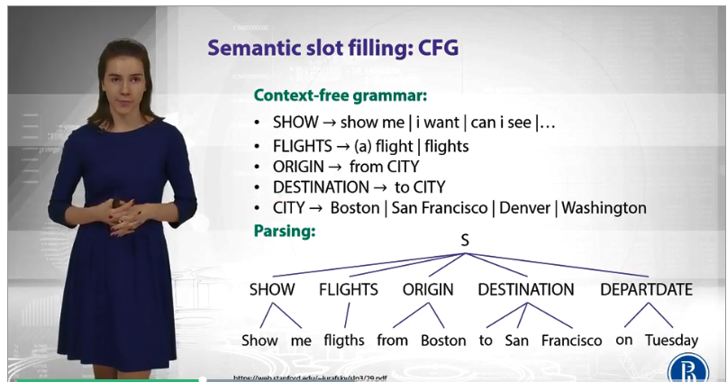
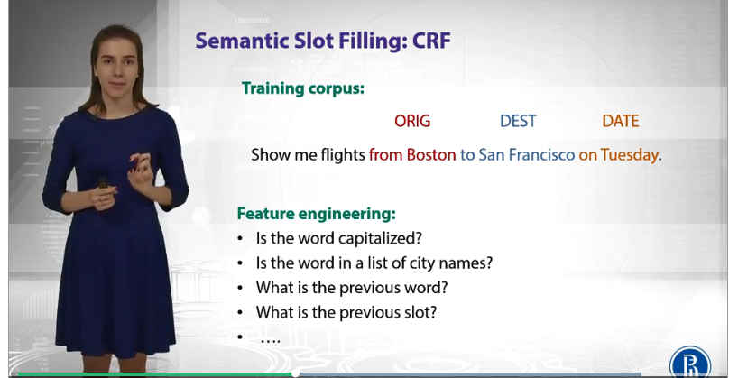
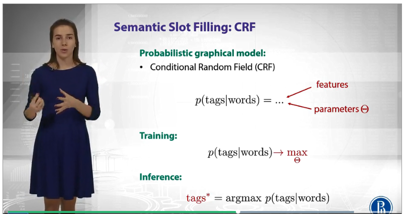
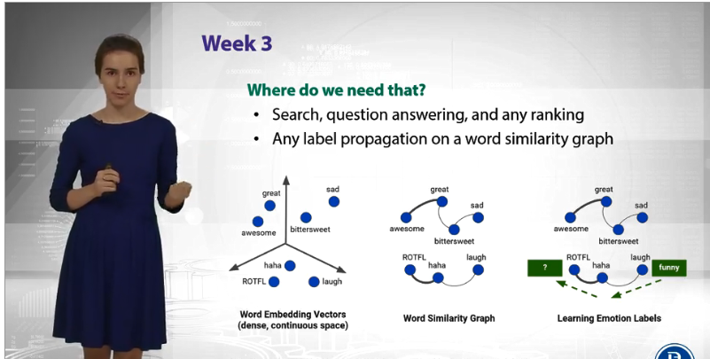
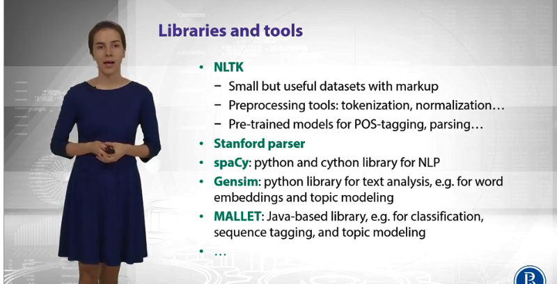
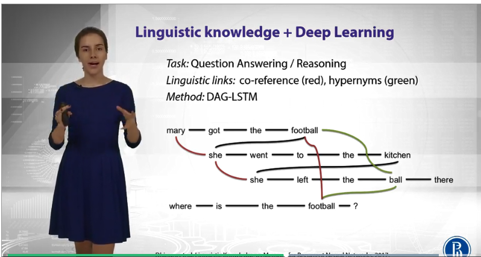
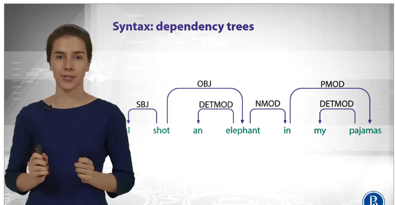
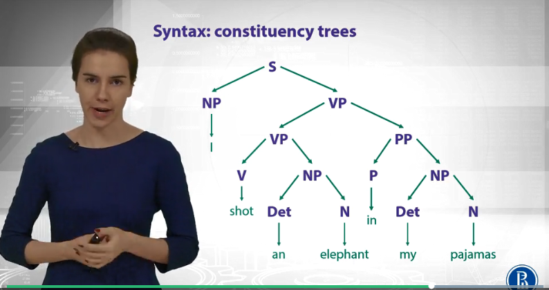

## Week 1:
### Main approaches in NLP

1. Rule-based methods (regular expression)
	Regular exressions
	Context-free grammers 

2. Probabilistic modeling and machine learning
	Likelihood maximization
	Linear classifiers	

3. Deep learning
	Recurrent Neural Network
	Convolutional Neural Networks

By Example:
	Semantic slot filling: CFG
	Show me flight from Boston to Sab Francisco on Tuesday

#### Context-free grammers 

A/D:
D: Manual rules to be written
A: Precision (low recall)

#### Machine learning
Steps:
1. Training corpus (markaps, annotation)
2. Feature engineering
3. Define model
4. Training (get parameters)
5. Inference (aka test)

#### Deep learning

1. Training corpus (markaps, annotation)
No such step 2. Feature engineering 
2. Feed sequence of words to NN
3. Define model
4. Training (get parameters)
5. Inference (aka test)

## Brief overview of the next weeks

### Week 1. Text classifcation
	- predict some tags or categories
	- predict sentiment 
	- spam filter

### Week 2.
	How to predict word sequences?
	- Language modeling - predict probabilites of next words (e.g. translation)	
	How to predict tags for the word sequences?
	*	Part-of-speech tags (e.g. some words are noun, verbs)
	*	Named entites (find city names for text clasisifcation)
	*	Sematic slots (parse the query)

### Week 3.

	How to represnt a meaning of a word, a sentence, or text?
	Meaninig - vector (words to vector), similar words will have similar vectors
	- Similar words will have the same vectors			
	- Topic models (document as whole, e.g find topic)	

	Where do we need it?
	 Distance between nodes gives results if words are close

	

### Week 4. 
	Sequence to sequence task
		* machine translate
		* summarization , simplificaiton
		* conversation chat-bot
	Encode-decode architecture

Week 5
	Dialogu agent build
	* fgoal-oriented (e.g. help in a call-center)
	* conversational (e.g entertaiment)
	
	Stackoverflow chat-bot.

## [Optional] Linguistic knowledge in NLP

Sentence analysis (NLP pyramid)

1. Morphology:
About different forms of words (care part-of-speech tag, gender). Everything about word. (NTLK lib, Standford parser)

2. Syntax  
Relationship betword words in sentance (object- subobjects) (NTLK lib)

3. Sematics (Gensim, MALLET)
Meanings 

4. Pragmatics

### Lingustic knowledge
1. WordNet - hierarchcal relatioship hyporim/hyypronim, meronims (whole-part)
2. BabelNet 

How to apply:
Task:
 	Question:  MAry got the footbal she went to the kitchen she left the ball there. Where is the football?

Solution: Deep learning (DAG-LSTM) 
 1. Reference (she = Mary, football is metioned twise)	
 2.  Hypiromix (football = ball)

DAG-LSTM use the parameters

## Syntex representation

Lingustic representation for later training

#### Syntax: dependency trees

#### Syntax: constituency trees

Where used:
1. Main entity recognition 
2. Sentiment analysis
2.1. Have santance
2.2 Parse it into a tree (using syntax)
2.3. Knowing sentiment of words you can build a tree and build sentiment of whole phrase

Recoursive NN, 

### How to: from plain texst to their classification

		Example: sentiment analysis

			*Input: text
			*Output: class of sentiment: positive/negative
			

		Text pre-processing
			Text is:
				* Charcters
				* Words
				* Phrases and named entitles
				* Paragraphs

			Words:
				Word is:
					Meanining sequence of characters

					In English, it's eay to find word

					Input: Friends, Romains, Countrymen, lend me your ears;
					Output: Friends Romans, Countrymen, lend, me, your, ears

			Token:
				meaningful unit furtheror further processing (e.g. word, phrase, sentence etC)	

				Example tokenizers: 
					*whitespace: ntlk.tokenize.WhitespaceTokenizer
						Problem: it, it? different tokens

					*punctuation: ntlk.tokenze.WordPunctTokenizer
						Problem: s, isn, t are not very meaningful

					*set of rules: ntlk.tokenze.TreebankTokenizer
						Example: 'This' 'is' 'Andrew' "'s" 'text' ','' 'is' "n't" 'it' '?'

			Token normalization:
				Problem statement:
					*wolf, wolves -> wolf
					*talk, talks -> talk

				Solution:
					Stemming - process of removing and replacing suffixes to get root form of the word which is called stem;
					nltk.stem.PorterStemming
						SSES -> SS
						IES -> I	
						wolves -> wolv
						feet -> feet
						talked -> talked *

					Lemmatization: same as stemming but doing things properly with the use of vocabularry and morphological analysis, return dictionary form of word - lemma
					nltk.stem.WordNetLemmatizer
						feet -> foot
						wolves -> wolf

						Problem: not all forms are reduces (e.g. talked -> talked)

			Further normalization
				 Normalizing capital letters
				 	US, us -> us
				 	us, US
				 	heuristic (lowercasing the beigning of the sentence, lowercasing words in titles etc)	

		Feature extracting from text (tokens 2 features)

			Bag of words (BOW)
				Marker words in the sentence which (non)presentce makes decision

				Count token occurences:
					Motivation: we're looking for marker words like "excelent" or "disappointed"
					For each token we will have a feature column, this is called - text vectorization

				  
										good movie not a did like
				  good movie 			  1	  1     0  0  0    0
				  not a good movie		  1	  1     1  1  0    0
				  did not like 			  0	  0     1  0  1    1

				  Problems:
				  	 - loose word order, hence the name "bag of words"
				  	 - counters are not normalized

			 Preserve some ordering
			 	n-gram:
			 		1-grams for token
			 		2-grams for token pairs

			 							good movie not a did like (good movie) ...
				  good movie 			  1	  1     0  0  0    0	   1
				  not a good movie		  1	  1     1  1  0    0	   0
				  did not like 			  0	  0     1  0  1    1		0	 

				  Problem:
				     - too many features

			Remove some n-grams based on frequency
				High frequency n-grams (articles, preposition =  stop-words);
				Low frequency n-grams (typos, rare n-grams);

				Medium frquency- remained (what's needed)

			There're lot of medium frequency n-grams
				the n-gram with small freq. can be more discriminating because it can capture the specific issues

			TF-IDF
				Idea: find high term frequency (in the given document) and a low document freq of the term in the while collection (specific issues)

				term freq (TF)
					- tf(t,d) - freq. for term (or n-gram) t in document d

				Freq variants:
					1. binary:  0/1
					2. count:   f[t,d]
					3. term freq: f[t,d] / sum(f[t,d])
					4. log norm: 1 + log (f[t,d])
				
				Inverse doc freq
					N = | D | - total number of documents
					|{d e D: t e d}| - number of document where the term t appears

					idf(t, D) = log( N / |{d e D: t e d}|)			

					TF-IDF:
						tfidf(t,d,D) = tf(t,d) * idf(t,d)

		Linear models for sentiment analysis	
			IMDB data:
				* 25000/25000 positive/negative
				* 30 review per movice
				* at least 7 stars -> positive (1)
				* at most 4 stars -> negative (0)
				* 50/50 train/test split
				* Evaluation accuracy

			TF-IDF
				* 2500

		Hashing trick in spam filtering

			

